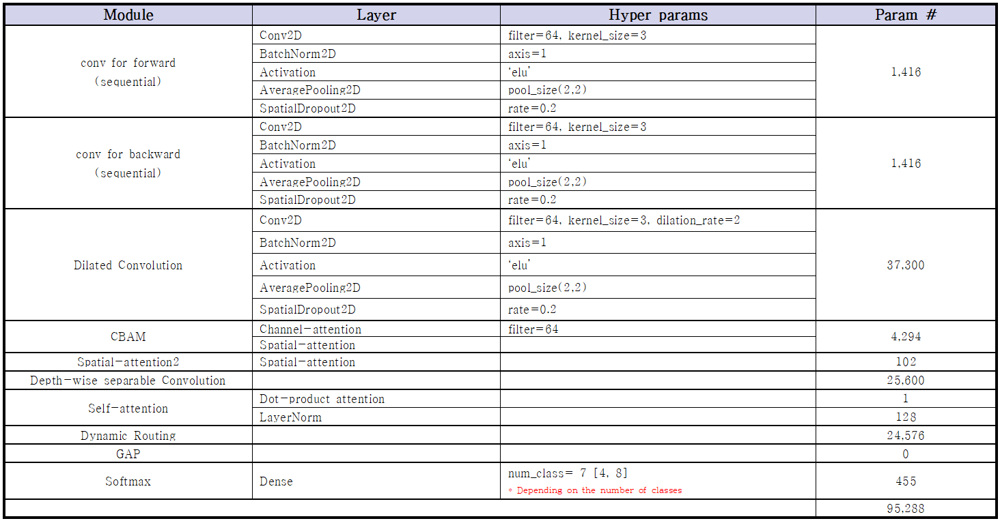

# A Light-weight Model for Speech Emotion Recognition based on Pattern Learning Block([PDF](https://drive.google.com/file/d/1KqAs1fCs856QRvU4TzJyRAl35mtB3y4s/view?usp=drive_link))

[Paper(Korean)](paper.pdf)

## 01. Data preprocessing

- feature : MFCC
  - `signal_len < 100,000` ... zero-padding
  - `else` ... cut

## 02. Model architecture

- **Pattern Learning Block(PLB)**

- **Proposed Model**

- Number of parameters each modules

## 03. Experiments + Ablation studies

- meaning
  - proposed : proposed model
  - others : remove module
    - DWSCNN : Depth-wise seperable Convolution
    - CBAM : Convolution Block Attention Module
    - Spa : Spatial-attention
    - SA : Self-attention
    - routing : Dynamic Routing

- **EMO-DB**

|Name|#Params|max_WA(%)|min_WA(%)|avg_WA(%)|code|
|----|-------|---------|---------|---------|----|
|proposed|95,288|90.76|<U>**85.11**</U>|<U>**88.18**</U>|[Link](★%20EMODB-training.ipynb)|
|DWSCNN|69,688|92.11|74.03|82.17|[Link](★%20ablation%20study/EMODB/remove-DWSCNN.ipynb)|
|CBAM|90,994|<U>**94.49**</U>|78.79|85.88|[Link](★%20ablation%20study/EMODB/remove-CBAM.ipynb)|
|Spa|93,770|92.11|82.38|87.24|[Link](★%20ablation%20study/EMODB/remove-Spatial.ipynb)|
|SA|95,160|92.93|79.53|84.51|[Link](★%20ablation%20study/EMODB/remove-SA.ipynb)|
|routing|70,712|87.42|70.83|78.66|[Link](★%20ablation%20study/EMODB/remove-Routing.ipynb)|
|**Δ**||-3.73|+2.73|+0.94||

- **RAVDESS**

|Name|#Params|max_WA(%)|min_WA(%)|avg_WA(%)|code|
|----|-------|---------|---------|---------|----|
|proposed|95,353|87.50|<U>**83.75**</U>|<U>**85.56**</U>|[Link](★%20RAVDESS-training.ipynb)|
|DWSCNN|69,753|78.12|65.62|72.68|[Link](★%20ablation%20study/RAVDESS/remove-DWSCNN.ipynb)|
|CBAM|91,059|<U>**88.12**</U>|81.25|84.87|[Link](★%20ablation%20study/RAVDESS/remove-CBAM.ipynb)|
|Spa|93,835|85.00|77.50|80.68|[Link](★%20ablation%20study/RAVDESS/remove-Spatial.ipynb)|
|SA|95,225|82.50|74.37|78.50|[Link](★%20ablation%20study/RAVDESS/remove-SA.ipynb)|
|routing|70,777|70.62|65.00|67.62|[Link](★%20ablation%20study/RAVDESS/remove-Routing.ipynb)|
|**Δ**||-0.62|+2.50|+0.69||

- **IEMOCAP**

|Name|#Params|max_WA(%)|min_WA(%)|avg_WA(%)|code|
|----|-------|---------|---------|---------|----|
|proposed|95,093|66.20|63.17|65.20|[Link](★%20IEMOCAP-training.ipynb)|
|DWSCNN|69,493|65.77|59.52|62.72|[Link](★%20ablation%20study/IEMOCAP/remove-DWSCNN.ipynb)|
|CBAM|90,799|69.00|63.47|65.07|[Link](★%20ablation%20study/IEMOCAP/remove-CBAM.ipynb)|
|Spa|93,575|<U>**69.96**</U>|<U>**65.69**</U>|<U>**67.40**</U>|[Link](★%20ablation%20study/IEMOCAP/remove-Spatial.ipynb)|
|SA|94,965|67.18|60.91|64.56|[Link](★%20ablation%20study/IEMOCAP/remove-SA.ipynb)|
|routing|70,517|66.66|62.21|64.30|[Link](★%20ablation%20study/IEMOCAP/remove-Routing.ipynb)|
|**Δ**||-3.76|-2.52|-2.20||

## 04. Real-time Inference

- setting
  - `batch_size = 1`
  - `Eq = all test dataset inference time / number of test dataset`
    - i.e. Average

- `Inference time / wav` (sec)

|H/W|EMO-DB|RAVDESS|IEMOCAP|
|---|------|-------|-------|
|RTX 3080TI|0.04371|0.03033|0.03416|
|i7-12700K|0.05000|0.04545|0.04510|
|RTX 2080TI|0.07182|0.06225|0.04953|
|i7-8700|0.07622|0.07257|0.06538|
|Raspberry Pi|1.42443|1.35941|1.22835|

## 05. Memory usage

- GPU peak memory usage
  - Maximum usage of GPU memory at the moment
  - via `tf.config.experimental.get_memory_info(‘GPU:0’)`
- Model size
  - saved model weights size

|Model|Num.Params|Peak memory usage(GB)|Model size(Mb)|
|-----|----------|---------------------|--------------|
|Proposed|95K|0.000627|0.433616|

## License
Non-commercial only
